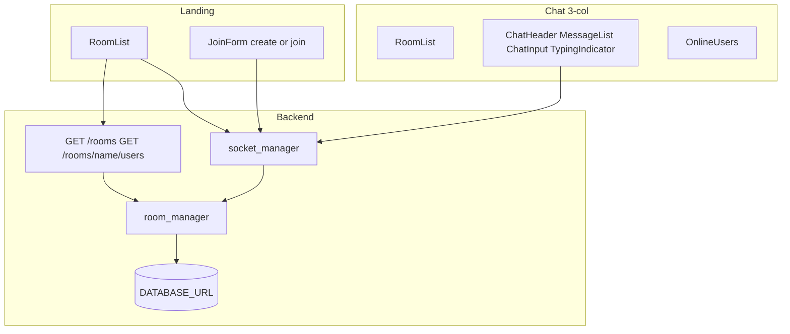

# Chat Feature Enhancements Plan

## Approach

Preserve the flat backend layout ([`backend/app/`](backend/app/)) and frontend folders (`components/chat`, `hooks`, `types`, `lib`). Extend [`RoomManager`](backend/app/room_manager.py), [`socket_manager.py`](backend/app/socket_manager.py), and [`useChat`](frontend/hooks/useChat.ts); rename/extract UI pieces to match the requested component list.

**Behavior change (intentional):** `join_room` will **stop auto-creating** rooms. Creation is explicit via `create_room`. Join of a missing room returns a structured error (`room_not_found`) so the UI can offer “Create this room”.

**Active rooms:** listed rooms are those with `active_users > 0`. When the last user leaves, the room is dropped from the live list (`room_list_updated`) but the DB row + message history remain (case-insensitive uniqueness + history on rejoin). Empty rooms are not shown on the landing list.

---

## Architecture (updated)

---

## Phase A — Backend models & schemas

Keep SQLAlchemy tables; enrich **Pydantic** response models to match the structured contract (map ORM fields → API names).

**Update [`schemas.py`](backend/app/schemas.py):**
- `CreateRoomPayload` — `room_name` (trim, 1–100)
- `JoinRoomPayload` — unchanged shape; normalize room case-insensitively for lookup
- `TypingPayload` — optional empty/`room` ack
- `UserOut` — `username`, `socket_id`, `joined_at`
- `MessageOut` — align aliases: `message_id`←`id`, `sender`←`username`, `text`←`content`, `timestamp`←`created_at`, `type` (`chat`|`system`) mapped from `message_type` (`user`→`chat`)
- `RoomSummaryOut` — `room_id`, `room_name`, `created_at`, `active_users` (count), optionally `users` for detail
- Keep backward-compatible dump helpers used by sockets so frontend can migrate cleanly in one pass

**Update [`models.py`](backend/app/models.py) lightly:**
- Add `name_normalized` column (`String`, unique, indexed) for case-insensitive uniqueness **or** query with `func.lower` + unique index. Prefer `name_normalized` (lowercased) written on create for portable SQLite/Postgres uniqueness.
- No new User table; continue `UserSession` as the live user model exposed as `UserOut`.

**Update [`room_manager.py`](backend/app/room_manager.py):**
- `create_room(name)` — validate; reject duplicate via `name_normalized`; return `(RoomSummaryOut, created: bool)`
- `join(...)` — **require existing room**; if missing raise `RoomError(code="room_not_found")`; reject duplicate username; reject if sid already in that room (`already_joined`); still write system join message
- `leave(...)` — same as today; return remaining `active_users` + whether room left the “active” set
- `list_active_rooms()` — rooms with `COUNT(sessions) > 0`, each with `active_users`
- `get_room_users(room)` — structured `UserOut[]` (case-insensitive name lookup)
- Helper `_broadcast_room_list_payload()` data builder shared by socket + REST

---

## Phase B — REST + Socket events

**[`main.py`](backend/app/main.py):**
- Keep `GET /health`
- Add `GET /rooms` → `list[RoomSummaryOut]`
- Add `GET /rooms/{room_name}/users` → `list[UserOut]` (404 if room missing)
- Use async session dependency (`get_session`) already in [`database.py`](backend/app/database.py)

**[`socket_manager.py`](backend/app/socket_manager.py) — add/adjust:**

| Client → Server | Behavior |
|-----------------|----------|
| `create_room` | Create; emit `room_created` + `room_list_updated` to all; ack/error to sid |
| `join_room` | No auto-create; on success emit history/users/join system msg; emit `room_list_updated` (user count) |
| `leave_room` / `disconnect` | Existing leave flow + `room_list_updated` |
| `send_message` | Unchanged persist/broadcast |
| `typing` / `stop_typing` | Require in-room session; broadcast to **room except sender** |

| Server → Client | Payload |
|-----------------|---------|
| `room_created` | `RoomSummaryOut` |
| `room_list_updated` | `{ rooms: RoomSummaryOut[] }` |
| `room_users` | `{ room, users: UserOut[] }` (upgrade from string[]) |
| `typing` / `stop_typing` | `{ username, room }` |
| existing | `new_message`, `user_joined`, `user_left`, `message_history`, `error` |

**Note:** Spec lists server `connection_status` — connection state is driven **client-side** from Socket.IO lifecycle (toasts + badge). No server emission required.

---

## Phase C — Frontend foundation

**Types** ([`types/chat.ts`](frontend/types/chat.ts)): mirror new payloads (`RoomSummary`, `UserOut`, message field aliases).

**Lib:** thin `lib/api.ts` for `GET /rooms` and `GET /rooms/{room}/users` using `NEXT_PUBLIC_SOCKET_URL` as API base.

**Hooks:**
- Extend [`useSocket`](frontend/hooks/useSocket.ts) — expose reconnect hooks for toasts
- Extend [`useChat`](frontend/hooks/useChat.ts) — rooms list state, `createRoom`, typing emit with 2s debounce, listen `room_list_updated` / `room_created` / `typing` / `stop_typing`
- Add `useTypingIndicator` (or keep typing state inside `useChat`) — local `isTyping` debounce 2s → `stop_typing`
- Add `useSmartScroll` — track `isNearBottom`; auto-scroll only when near bottom; resume when user scrolls to bottom

**Toast:** add shadcn `sonner` (or a small `ToastProvider` context). Wire:
- Connected / Reconnected / Connection lost from socket events

---

## Phase D — UI components (rename + new)

Rename/extract under [`frontend/components/chat/`](frontend/components/chat/) to match the spec (update imports; delete old names):

| Component | Role |
|-----------|------|
| `UserAvatar` | Initials + tone (extracted from MessageItem) |
| `RoomCard` | Name, online count, created time; click selects room |
| `RoomList` | Maps rooms; empty: “No active rooms available”; loading/error |
| `ConnectionBadge` | Rename from `ConnectionStatusBadge`; labels `🟢 Connected` / `🟡 Reconnecting` / `🔴 Disconnected` |
| `ToastProvider` | App-level provider in [`layout.tsx`](frontend/app/layout.tsx) |
| `ChatHeader` | Room title, status badge, leave (extracted from ChatLayout) |
| `MessageBubble` | Rename MessageItem; sender + text + **always-visible** `HH:mm` (24h, `hour12: false`); system = centered muted with dash separators |
| `MessageList` | Smart scroll + empty “No messages yet. Start the conversation 👋” |
| `TypingIndicator` | “Alex is typing…” / multi-user compact form |
| `ChatInput` | Rename MessageInput; emit typing on change |
| `OnlineUsers` | `UserAvatar`, highlight self, count, empty “No users online” |
| `JoinForm` | Username + room + Create Room / Join; prefill room from `RoomCard`; success banner/toast on create |
| `ChatLayout` | **3-column:** Rooms \| Chat \| Online Users; mobile drawers for both sidebars |

**Landing vs joined** ([`page.tsx`](frontend/app/page.tsx)):
- Not joined: header + `RoomList` + join/create form (rooms subscribed via socket after connect-for-lobby or poll `GET /rooms` + subscribe once socket connects)
- Joined: full 3-column `ChatLayout`

**Lobby socket:** on landing, `connect()` and listen for `room_list_updated` (and initial hydrate via `GET /rooms`) so the list stays live before join.

---

## Phase E — Display polish (Features 3, 7, 8, 9)

- Timestamps: `Intl.DateTimeFormat(undefined, { hour: "2-digit", minute: "2-digit", hour12: false })` — secondary muted text on every message including system
- System style: centered muted text flanked by horizontal rules / `----------` separators
- Auto-scroll: implement near-bottom threshold (~80px) in `MessageList`
- Empty states: exact copy from the request

---

## Phase F — Validation

1. Frontend `npm run build` + backend import
2. Manual: two tabs — create room, list updates, join, chat, typing, leave empties list, reconnect toasts
3. `GET /rooms` and `GET /rooms/{room}/users` smoke via curl
4. Extend [`backend/scripts/e2e_socket_smoke.py`](backend/scripts/e2e_socket_smoke.py) for `create_room`, typing, and `room_list_updated`
5. Update [`README.md`](README.md) event/API tables

---

## Assumptions

1. Active room list = rooms with ≥1 online user; empty rooms stay in DB for history/uniqueness but are hidden from the list.
2. Join no longer auto-creates; UI offers Create when join fails with `room_not_found`.
3. Message wire format upgrades to structured fields (`message_id`, `sender`, `text`, `timestamp`, `type`); frontend updated in the same change set.
4. `connection_status` is client-derived (badge + toasts), not a server emit.
5. Typing is ephemeral (not persisted).
6. “Prevent joining the same room multiple times” = same sid already in that room → clear error; username still unique per room.
7. Prefer adding `sonner` via shadcn for toasts rather than a from-scratch toast system.

## Out of scope (future)

Auth, private rooms, Redis presence, Alembic migrations for `name_normalized` beyond `create_all`, room rename/delete admin UI, typing in REST.